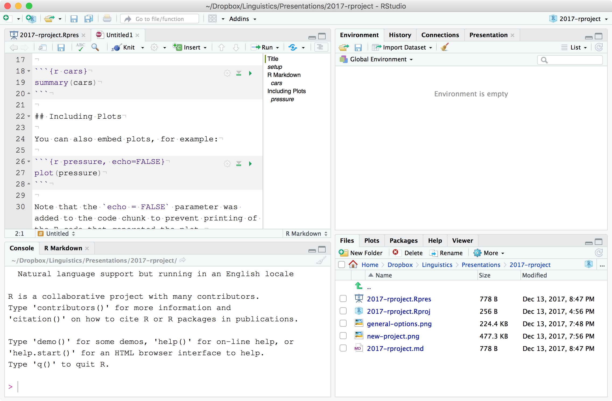
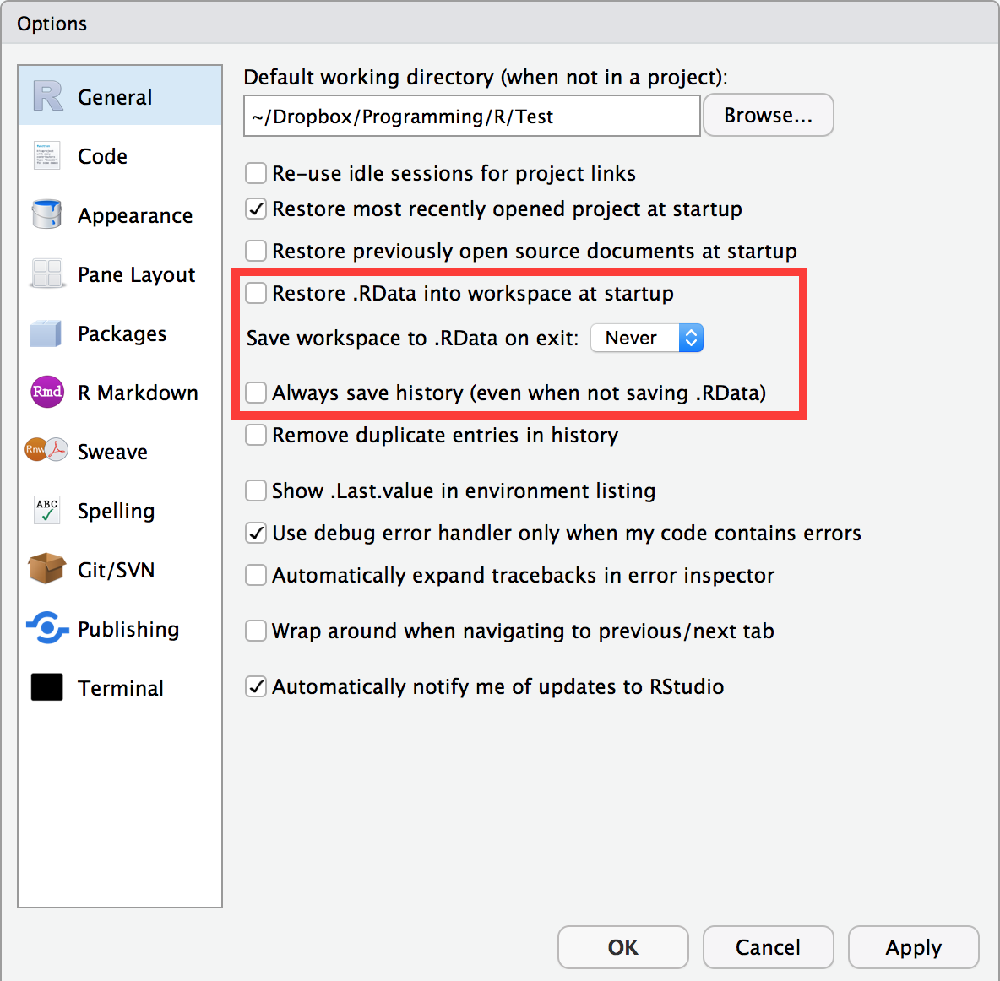
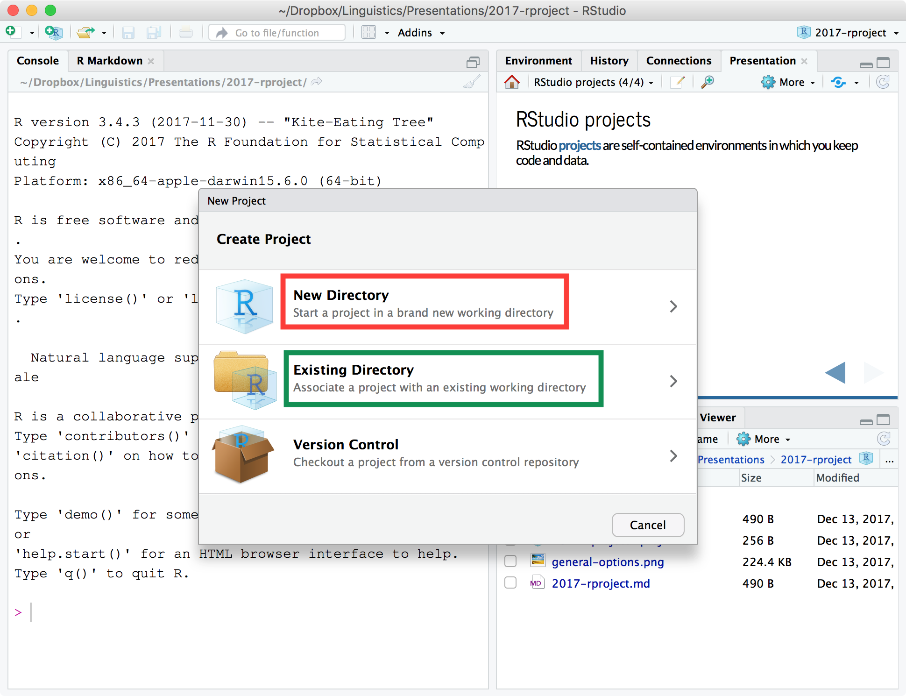
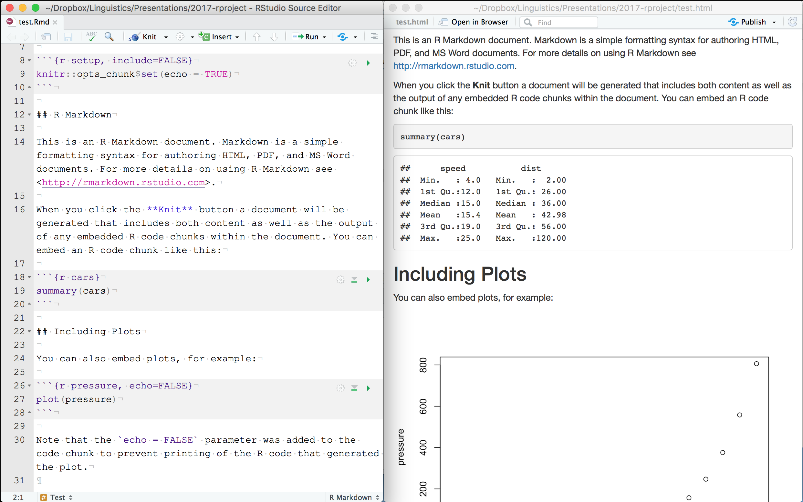

```{r setup, include=FALSE}
options(htmltools.dir.version = FALSE)
xaringanExtra::use_xaringan_extra(c("panelset", "tachyons"))
```

```{r xaringan-themer, include=FALSE, warning=FALSE}
library(xaringanthemer)
style_mono_accent(
  base_color = "#1c5253",
  header_font_google = google_font("Josefin Sans"),
  text_font_google   = google_font("Montserrat", "300", "300i"),
  code_font_google   = google_font("Fira Mono")
)
```

# RStudio

.center[]

---

# RStudio options

.center[]

---

# RStudio projects

RStudio **projects** are self-contained environments in which you keep code and data.

.center[]

---

# RStudio projects

.pull-left[
Advantages


- You can open and work on **multiple projects** at a time.

- The files of each individual projects are easily accessible by using **relative paths**, so goodby to `setwd()` (for example `./data/results.csv` if your project has a file `results.csv` in the `data/` folder).

- You can **isolate** package **dependencies** with `renv`.

- It simplifies the **distribution** of your research (for example, as an R package).
]

--

.pull-right[
Disadvantages

- **None**!
]

---

# Organising folders and files

From the [Open Science Framework](http://help.osf.io/m/bestpractices/l/611391-organizing-files).

* Separate DATA and CODE.

* Separate RAW data and DERIVED data.

* Treat raw data as READ-ONLY.

* Use a versioning system (like `git` with GitHub).

---

# Research compendia with R packages

* <https://github.com/ropensci/rrrpkg>

* <https://www.r-bloggers.com/how-to-develop-good-r-packages-for-open-science/>

* <http://r-pkgs.had.co.nz>

---

# R Markdown

**Dynamic report** writing in R with R Markdown and `knitr`.

* <http://rmarkdown.rstudio.com>

* Text and code in a single document (`.Rmd`).

* Several output formats (`.html`, `.pdf`, `.docx`, ...).

* R Markdown templates for journal submissions: <https://github.com/rstudio/rticles>.

---

# R Markdown

.center[]

---

# Summary

* Use **RStudio**.

* **Don't save `.Rdata`** and do not load it at start up.

* Separate **code** and **data** (*raw* and *derived*).

* Use **dynamic reports** with R Markdown (avoid copy-paste).
